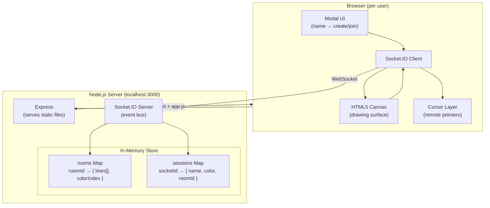
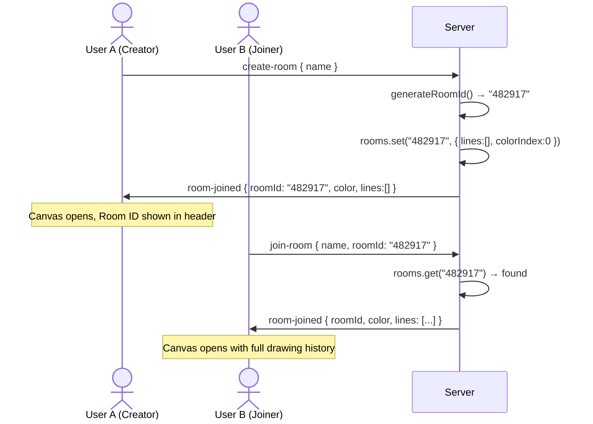
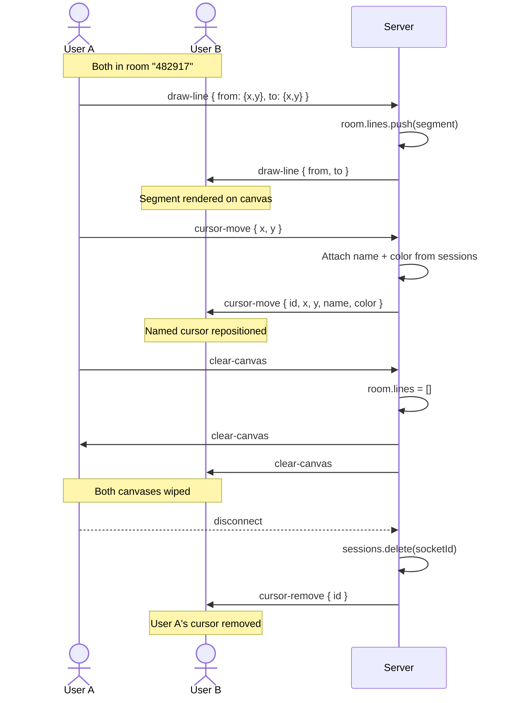
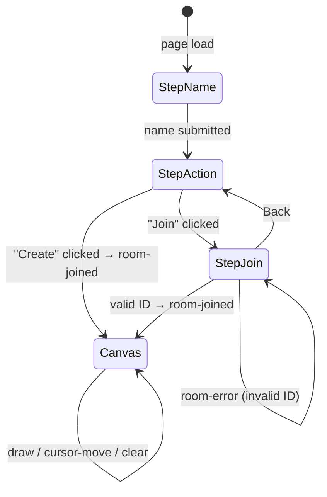

# Realtime Whiteboard

A collaborative drawing app where multiple users share a live canvas, see each other's cursors with name labels, and draw together in real time — all over WebSockets with zero framework overhead.

---

## Features

- **Whiteboard Rooms** — Create a room and get a 6-digit ID to share, or join an existing room by ID
- **Freehand Drawing** — Smooth pencil strokes synced instantly to every participant in the room
- **Named Cursors** — Every user gets a unique color; their name floats next to their cursor in real time
- **State Replay** — Late joiners receive the full drawing history so they see what was drawn before they arrived
- **Clear Canvas** — One click wipes the board for everyone in the room
- **Responsive** — Works on desktop and touch devices (uses Pointer Events API)

---

## Tech Stack

| Layer | Technology |
|---|---|
| Frontend | Vanilla HTML, CSS, JavaScript |
| Drawing | HTML5 Canvas API |
| Real-time | Socket.IO v4 |
| Server | Node.js + Express |
| Transport | WebSocket (with long-polling fallback) |

---

## Architecture

### System Components



---

### Room Lifecycle



---

### Real-Time Event Flow



---

### Frontend State Machine



---

## Project Structure

```
realtime-whiteboard/
├── server.js           # Express + Socket.IO server, room + session management
├── package.json
└── public/
    ├── index.html      # App shell + multi-step modal markup
    ├── app.js          # Canvas drawing, cursor rendering, socket event handlers
    └── styles.css      # Layout, modal, action cards, remote cursor styles
```

---

## Getting Started

**Prerequisites:** Node.js 18+

```bash
# Install dependencies
npm install

# Start the server
npm start
```

Open [http://localhost:3000](http://localhost:3000) in two browser tabs to test collaboration.

---

## How to Collaborate

1. **Tab 1** — Enter your name → click **Create a whiteboard** → note the 6-digit Room ID shown in the header
2. **Tab 2** (or share with someone else) — Enter your name → click **Join a whiteboard** → enter the Room ID
3. Draw on either canvas — strokes and cursors sync in real time

---

## Socket.IO Event Reference

| Event | Direction | Payload | Description |
|---|---|---|---|
| `create-room` | Client → Server | `{ name }` | Create a new room |
| `join-room` | Client → Server | `{ name, roomId }` | Join existing room |
| `room-joined` | Server → Client | `{ roomId, color, lines }` | Confirm join, send history |
| `room-error` | Server → Client | `{ message }` | Room not found |
| `draw-line` | Both | `{ from: {x,y}, to: {x,y} }` | Draw a line segment |
| `cursor-move` | Both | `{ id, x, y, name, color }` | Update cursor position |
| `cursor-remove` | Server → Client | `socketId` | User disconnected |
| `clear-canvas` | Both | — | Wipe the board |
